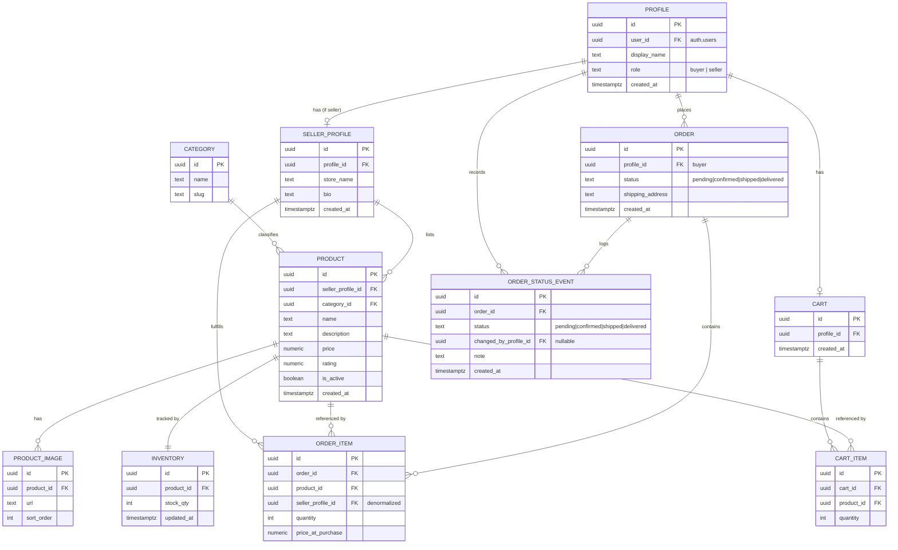

# Entity Architecture — Ecommerce Marketplace (v1)

The v1 data model: the 10 required entities from `SPEC.md`, plus
`ORDER_STATUS_EVENT` added in step 03 — 11 tables in total — with their fields
and relationships.

Implemented in `supabase/migrations/`; RLS proven by `supabase/tests/rls_verification.sql`.

## Relationships

| From | To | Cardinality | Notes |
|---|---|---|---|
| Profile | SellerProfile | 1 — 0..1 | Present only when `role = seller` |
| Profile | Cart | 1 — 0..1 | One active cart per buyer |
| Profile | Order | 1 — N | Buyer's order history |
| SellerProfile | Product | 1 — N | A seller's listings |
| Category | Product | 1 — N | Fixed v1 category set |
| Product | ProductImage | 1 — N | Ordered via `sort_order` |
| Product | Inventory | 1 — 1 | Single stock count per product |
| Cart | CartItem | 1 — N | |
| CartItem | Product | N — 1 | |
| Order | OrderItem | 1 — N | |
| OrderItem | Product | N — 1 | Snapshot price at purchase |
| OrderItem | SellerProfile | N — 1 | Denormalized so a seller can query only their line items across all orders |
| Order | OrderStatusEvent | 1 — N | Append-only transition log |
| OrderStatusEvent | Profile | N — 0..1 | Who made the change; null if that profile is later removed |

## RLS Intent (per table)

| Table | Read | Write |
|---|---|---|
| Profile | Own row (+ public display_name via join where needed) | Owner only |
| SellerProfile | Public | Owner only |
| Category | Public | None (admin-seeded, no UI in v1) |
| Product | Public where `is_active = true`, **or** the owning seller's own rows regardless of the flag — otherwise a seller's deactivated listings vanish from `/seller/products` | Owner (`seller_profile_id` matches caller) |
| ProductImage | Public, where the parent Product is visible to the caller | Owner of parent Product |
| Inventory | Public (stock/availability display), where the parent Product is visible | Owner of parent Product |
| Cart | Owner only | Owner only |
| CartItem | Owner (via parent Cart) | Owner (via parent Cart) |
| Order | Owner (buyer) **or** a seller with a line item in it | Insert by owner (buyer) at checkout; `status` update by a seller with a line item in it. No delete |
| OrderItem | Owner (buyer, via parent Order) **or** seller where `seller_profile_id` matches caller | Insert by buyer at checkout, and only where `seller_profile_id` matches the product's true seller. `status`-relevant updates happen on `Order`, not `OrderItem`. No update, no delete — an immutable purchase record |
| OrderStatusEvent | Same audience as the parent Order | Insert only, by a participant: a seller for any transition they may make, the buyer for the opening `pending` event at checkout. Always stamped with the caller's own profile. No update, no delete — append-only |

Two implementation notes from step 03:

- RLS gates rows, not columns, so `Order` additionally carries a column grant
  restricting a seller's update right to `status` alone — without it, the update
  policy would also let a seller rewrite `shipping_address`.
- Ownership predicates live in a `private` schema, not `public`. Anything in
  `public` is published by PostgREST as an RPC endpoint, which would make every
  helper callable by `anon`.

Known v1 limitation: status lives on the Order rather than the OrderItem, so in
an order spanning two sellers either seller advances the status for the whole
order. `OrderStatusEvent.changed_by_profile_id` makes that attributable.

## Coverage Check

Screens: Product Home, Search/Filter, Product Detail, Seller Signal/Profile, Cart, Checkout, Customer Order Status, Seller Dashboard, Product Management, Seller Order Status Updates, Supporting Systems — all covered in `visual-architecture.md`.

Entities: Profile, SellerProfile, Category, Product, ProductImage, Inventory, Cart, CartItem, Order, OrderItem, OrderStatusEvent — all covered above.

## Fields the UI has and the schema does not

Seeding the demo marketplace (`supabase/migrations/20260813101702_seed_marketplace_demo_data.sql`) transcribed `lib/data/` into these tables one-for-one, and three fields of the presentational view-models in `lib/types/ui.ts` had nowhere to land. The schema is unchanged and intentionally so — each is a decision step 04 has to make, not an omission:

- **`SeedProduct.featured`** — drives the homepage rail. A presentation flag rather than a catalog fact, so it stays derived in app code unless the homepage needs seller-controlled merchandising, which v1 does not. Step 06 kept that decision: the featured slugs are a constant in `lib/data/products.ts`.
- **Category display order** — `Category` has no sort column, but the chip row and filter dropdown are in a curated order (Electronics first, Toys & Games last), not alphabetical. Step 06 kept the order in app code (`CATEGORY_ORDER` in `lib/data/categories.ts`) for the same reason as `featured`. Add a `sort_order` column if categories ever become admin-editable.
- **`OrderRecord.orderNumber`** (`#112-9876543`) — `Order` has no `order_number`. Either derive a display number from the order id, or add the column if the number must be stable and human-quotable.
- **Product slug** — ~~open~~ **resolved in step 06.** `20260813142414_add_product_slug.sql` adds `products.slug` (`text not null unique`), backfilled by recomputing the seed's own `uuid_generate_v5(<namespace>, 'product:' || slug)` id expression. The route keeps its slugs and the uuid stays behind the `lib/data/` seam. Moving to uuids was rejected because the seed cart and seed orders still key on slugs, so a uuid catalog beside a slug cart would split the key space until the cart persistence step lands.

  Note for that step: `slug` has no default and no generation logic, because v1 has no product-create UI. A seller-facing create form must supply one.
