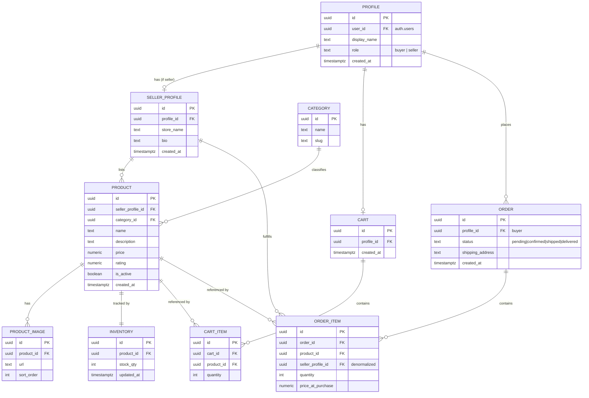

# Entity Architecture — Ecommerce Marketplace (v1)

The v1 data model: 10 required entities, their fields, and relationships.

## Relationships

| From | To | Cardinality | Notes |
|---|---|---|---|
| Profile | SellerProfile | 1 — 0..1 | Present only when `role = seller` |
| Profile | Cart | 1 — 0..1 | One active cart per buyer |
| Profile | Order | 1 — N | Buyer's order history |
| SellerProfile | Product | 1 — N | A seller's listings |
| Category | Product | 1 — N | Fixed v1 category set |
| Product | ProductImage | 1 — N | Ordered via `sort_order` |
| Product | Inventory | 1 — 1 | Single stock count per product |
| Cart | CartItem | 1 — N | |
| CartItem | Product | N — 1 | |
| Order | OrderItem | 1 — N | |
| OrderItem | Product | N — 1 | Snapshot price at purchase |
| OrderItem | SellerProfile | N — 1 | Denormalized so a seller can query only their line items across all orders |

## RLS Intent (per table)

| Table | Read | Write |
|---|---|---|
| Profile | Own row (+ public display_name via join where needed) | Owner only |
| SellerProfile | Public | Owner only |
| Category | Public | None (admin-seeded, no UI in v1) |
| Product | Public (where `is_active = true`) | Owner (`seller_profile_id` matches caller) |
| ProductImage | Public | Owner of parent Product |
| Inventory | Public (stock/availability display) | Owner of parent Product |
| Cart | Owner only | Owner only |
| CartItem | Owner (via parent Cart) | Owner (via parent Cart) |
| Order | Owner (buyer) | Insert by owner (buyer) at checkout |
| OrderItem | Owner (buyer, via parent Order) **or** seller where `seller_profile_id` matches caller | Insert by buyer at checkout; `status`-relevant updates happen on `Order`, not `OrderItem`, so seller updates target `Order.status` scoped to orders containing their `OrderItem` rows |

## Coverage Check

Screens: Product Home, Search/Filter, Product Detail, Seller Signal/Profile, Cart, Checkout, Customer Order Status, Seller Dashboard, Product Management, Seller Order Status Updates, Supporting Systems — all covered in `visual-architecture.md`.

Entities: Profile, SellerProfile, Category, Product, ProductImage, Inventory, Cart, CartItem, Order, OrderItem — all covered above.
