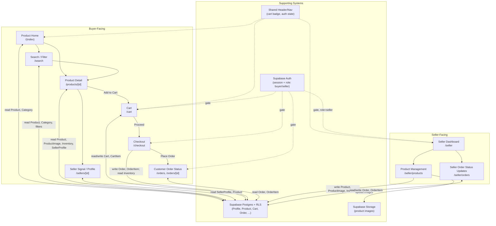

# Visual Architecture — Ecommerce Marketplace (v1)

Screens, navigation flow, and the supporting systems behind them.

## Screen Reference

| Screen | Route | Primary Entities Touched | Auth Requirement |
|---|---|---|---|
| Product Home | `/` | Product, Category | Public |
| Search / Filter | `/search` | Product, Category (filters: category, price, rating, seller, availability) | Public |
| Product Detail | `/products/[id]` | Product, ProductImage, Inventory, SellerProfile | Public |
| Seller Signal / Profile | `/sellers/[id]` | SellerProfile, Product | Public |
| Cart | `/cart` | Cart, CartItem, Product | Buyer |
| Checkout | `/checkout` | Cart, CartItem, Order, OrderItem, Inventory | Buyer |
| Customer Order Status | `/orders`, `/orders/[id]` | Order, OrderItem | Buyer (owner) |
| Seller Dashboard | `/seller` | SellerProfile, Product, Order (summary) | Seller |
| Product Management | `/seller/products` | Product, ProductImage, Inventory | Seller (owner) |
| Seller Order Status Updates | `/seller/orders` | Order, OrderItem (filtered by seller) | Seller (owner) |
| Sign Up | `/signup` | Profile (created by the `handle_new_user` trigger) | Public |
| Sign In | `/signin` | — (Supabase Auth only) | Public |
| Sign Out | `/signout` (POST action, no page) | — (Supabase Auth only) | Logged-in |
| Account | `/account` | Profile | Logged-in |

Auth screens were added in step 05 (`.claude/specs/05-supabase-auth-integration.md`). This document originally modelled auth as a supporting system with no routes of its own; sign-up, sign-in and a profile shell need real screens, so they are recorded here.

**The "Auth Requirement" column above states the intended end state, not what is currently enforced.** As of step 05 only `/account` is gated. The Buyer and Seller rows are still ungated in code, because those screens read the local seed layer in `lib/data/` rather than per-user database rows — gating them would lock visitors out of screens that hold no private data. Step 04 (`.claude/specs/04-supabase-data-layer-swap.md`) repoints them at Postgres and applies the gates at the same time.

## Supporting Systems

- **Supabase Auth** — email/password sessions; a `role` on `Profile` (buyer/seller) gates access to seller routes and owner-only buyer routes (cart, checkout, orders).
- **Supabase Postgres + RLS** — single source of truth for all entities; every table's row-level security policy enforces the "Auth Requirement" column above (public read where marked Public, owner-scoped read/write otherwise).
- **Supabase Storage** — holds product images referenced by `ProductImage.url`; writes happen only from Product Management, gated to the owning seller.
- **Shared Header/Nav** — cross-cutting UI (not a route): shows auth state and live cart item count on every buyer-facing page.
